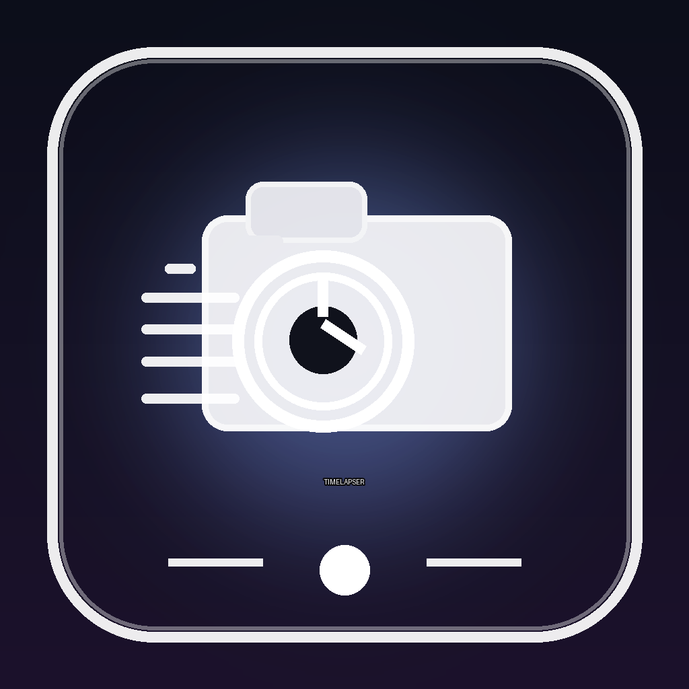

# Timelapser

A lightweight desktop application that records your screen while you draw and automatically generates smooth timelapse videos with efficient storage usage.

[Download](../../releases/latest) • [Report a Bug](../../issues) • [Request a Feature](../../issues)

---

## About

Timelapser is a lightweight desktop application designed for digital artists who want to capture their creative process without filling their storage with massive screen recordings.

Simply start recording, draw as you normally would, stop recording, and let Timelapser generate a smooth timelapse of your artwork.

> **Note**
>
> Timelapser is currently in early development. The interface and features will continue to improve over time.

---

## Features

- Automatic screen recording while drawing
- Smooth timelapse generation
- Efficient storage usage
- Lightweight and easy to use
- Works with most drawing applications
- Customizable recording settings

---

## Installation

1. Download the latest release from the Releases page.
2. Run `Timelapser.exe`.
3. Start recording.
4. Draw normally.
5. Stop recording and export your timelapse.

---

## Demo

A demo video is available in the `assets/videos` folder.

---

## Roadmap

- Improved user interface
- Additional export options
- Better performance
- More recording settings
- Quality improvements

---

## Contributing

Feedback, bug reports, feature requests, and pull requests are welcome.

---

## License

This project is licensed under the MIT License.

---

Created by Cartifuture

If you enjoy Timelapser, consider giving the repository a star.

