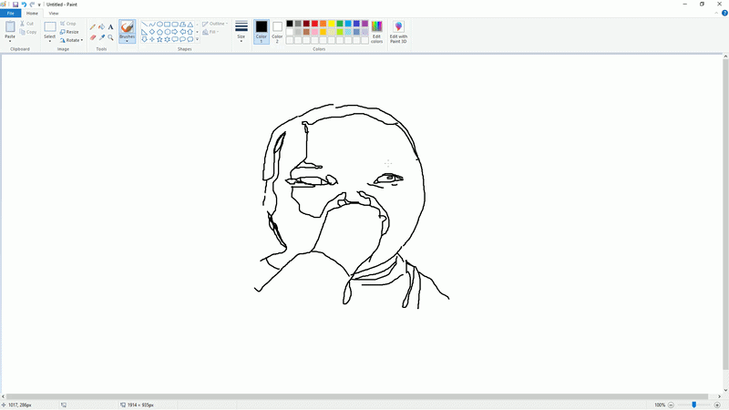

<div align="center">


# 🎬 Timelapser

### Draw. Record. Done.

**A lightweight desktop app that silently captures your screen while you draw, then turns it into a smooth, storage-friendly timelapse — automatically.**

<br>

[](https://github.com/cccartiii/Timelapser/releases/latest)
[](https://github.com/cccartiii/Timelapser/releases/latest)
[](LICENSE)
[](https://github.com/cccartiii/Timelapser/stargazers)

<br>



<br><br>

<a href="https://github.com/cccartiii/Timelapser/releases/latest"></a>
&nbsp;
<a href="https://github.com/cccartiii/Timelapser/issues"></a>
&nbsp;
<a href="https://github.com/cccartiii/Timelapser/issues"></a>

</div>

<br>

<p align="center">
  <sub>⚠️ <b>Early development</b> — expect bugs, expect rapid changes, expect it to get a lot better fast.</sub>
</p>

---

<br>

## 📋 Table of Contents

- [About](#-about)
- [Features](#-features)
- [Installation](#-installation)
- [Usage](#-usage)
- [Roadmap](#-roadmap)
- [Contributing](#-contributing)
- [License](#-license)

<br>

## ✨ About

Most artists who timelapse their process end up with one of two problems: **hours of raw footage** eating up disk space, or a clunky manual editing step just to make it watchable.

**Timelapser** solves both. It runs quietly in the background while you draw, capturing frames efficiently instead of recording continuous video. When you stop, it automatically compiles everything into a clean, smooth timelapse — ready to export and share.

No editing software. No 20GB recordings. No extra steps.

<br>

## 🚀 Features

<table>
<tr>
<td width="50%" valign="top">

**🎥 Automatic Recording**
Starts capturing the moment you hit record — no configuration needed.

**⚡ Instant Timelapse Generation**
Your video is compiled automatically the moment you stop.

**💾 Storage-Efficient**
Captures smart, not heavy — no bloated raw footage sitting on your drive.

</td>
<td width="50%" valign="top">

**🪶 Lightweight**
Minimal CPU/RAM footprint so it won't slow down your drawing software.

**🎨 Works With Your Tools**
Compatible with most popular drawing and illustration software.

**⚙️ Customizable Settings**
Tune recording behavior to match your workflow.

</td>
</tr>
</table>

<br>

## 📦 Installation

<table>
<tr><td>

**1.** Head to the [**latest release**](https://github.com/cccartiii/Timelapser/releases/latest)

**2.** Download `Timelapser.exe`

**3.** Run it — no installer, no setup

</td></tr>
</table>

> 💡 Windows may flag the `.exe` as unrecognized since it isn't code-signed yet. Click **More info → Run anyway** to proceed.

<br>

## 🖌️ Usage

```
1. Open Timelapser              →  Launch the app
2. Click "Start Recording"      →  Begin capturing your screen
3. Draw normally                →  Use any drawing software you like
4. Click "Stop Recording"       →  Timelapser compiles your timelapse
5. Export & share                →  Your video is ready to go
```

<br>

## 🗺️ Roadmap

- [ ] Improved user interface
- [ ] More export formats
- [ ] Better performance & lower resource usage
- [ ] Custom FPS settings
- [ ] Additional recording options
- [ ] Multi-monitor support
- [ ] macOS / Linux support

Got an idea that's missing? [**Open a feature request →**](https://github.com/cccartiii/Timelapser/issues)

<br>

## 🤝 Contributing

Contributions, bug reports, and feature suggestions are always welcome — this project is early-stage and every bit of input helps shape it.

```bash
# 1. Fork the repo
# 2. Create your feature branch
git checkout -b feature/your-feature

# 3. Commit your changes
git commit -m "Add: your feature"

# 4. Push and open a Pull Request
git push origin feature/your-feature
```

Found a bug or have an idea? [**Open an issue →**](https://github.com/cccartiii/Timelapser/issues)

<br>

## 📄 License

Licensed under the **MIT License** — see [LICENSE](LICENSE) for details.

<br>

---

<div align="center">

Made with ❤️ by **[cccartiii](https://github.com/cccartiii)**

<sub>If Timelapser saved you disk space (and sanity), consider dropping a ⭐ — it really helps.</sub>

</div>
